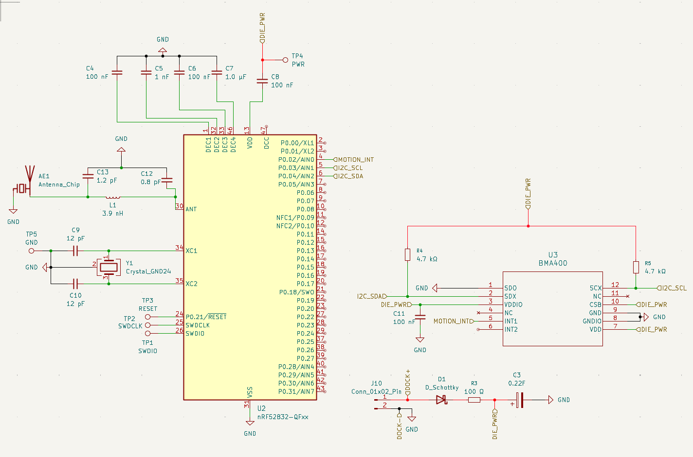
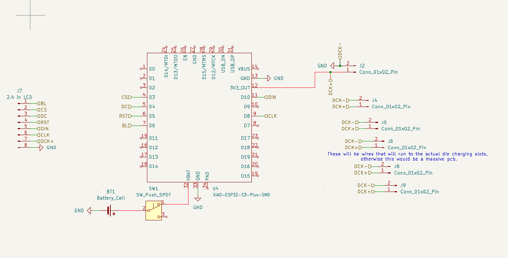
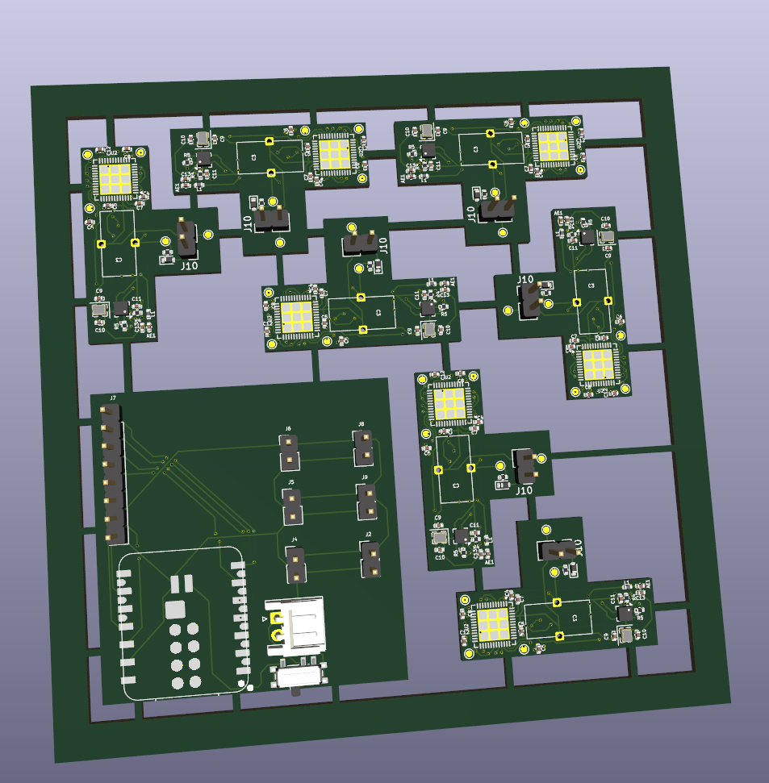
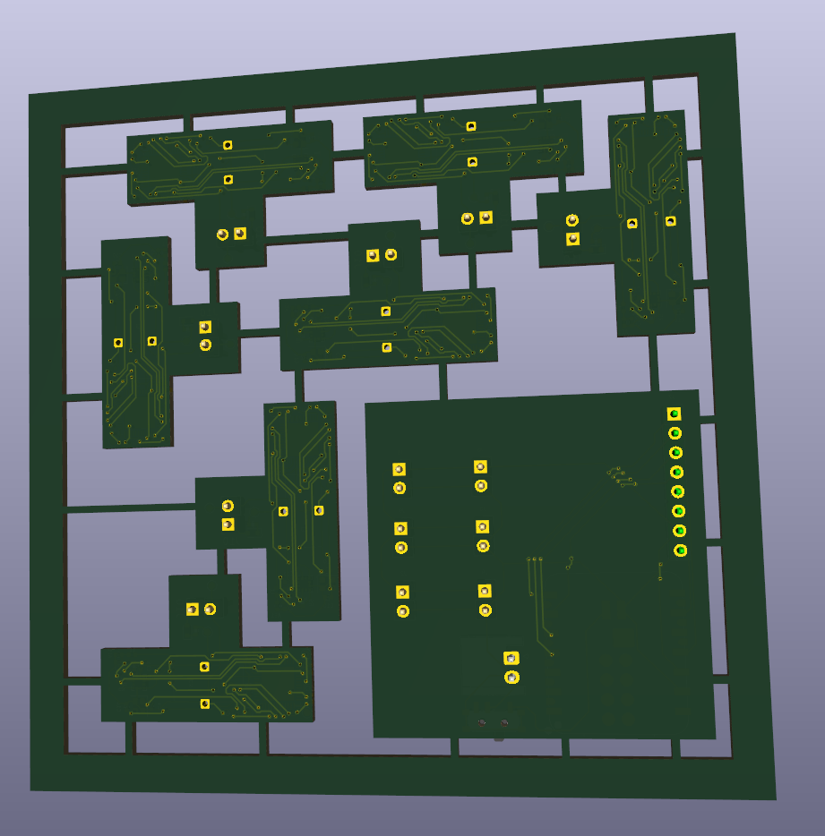
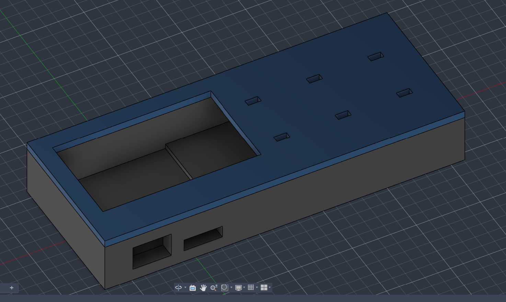

# WirelessDice
A set of RPG dice with a charging hub that can send the rolls wirelessly. (UNFINISHED) 
They are all (mostly) standard size RPG dice, and can tell what they roll based using an accelerometer paired with an nrf chip 
They are capable of charging within a few seconds due to using a supercapacitor 
Here's some pictures of the design 
Die Schematic:

Hub Schematic:

PCB Front:

PCB Back:

Hub Case:

Costs: <a href="https://www.amazon.com/hz/wishlist/ls/28VBMUP4FWW5W?ref_=wl_share">Amazon List</a> 
-PCB+Stencil - $15 
-Battery+Magnets+Display - $40 
-Digikey parts+shipping+tariff (in BOM) - $150 
